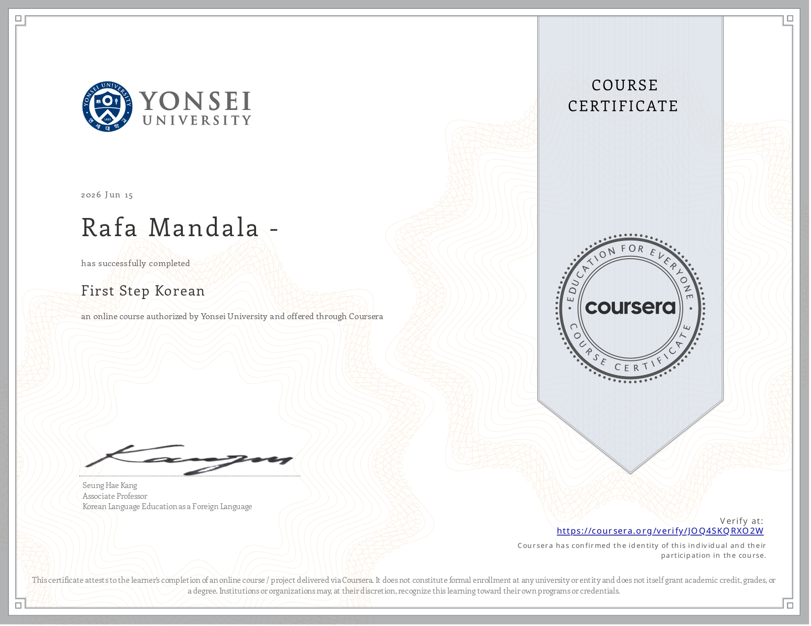
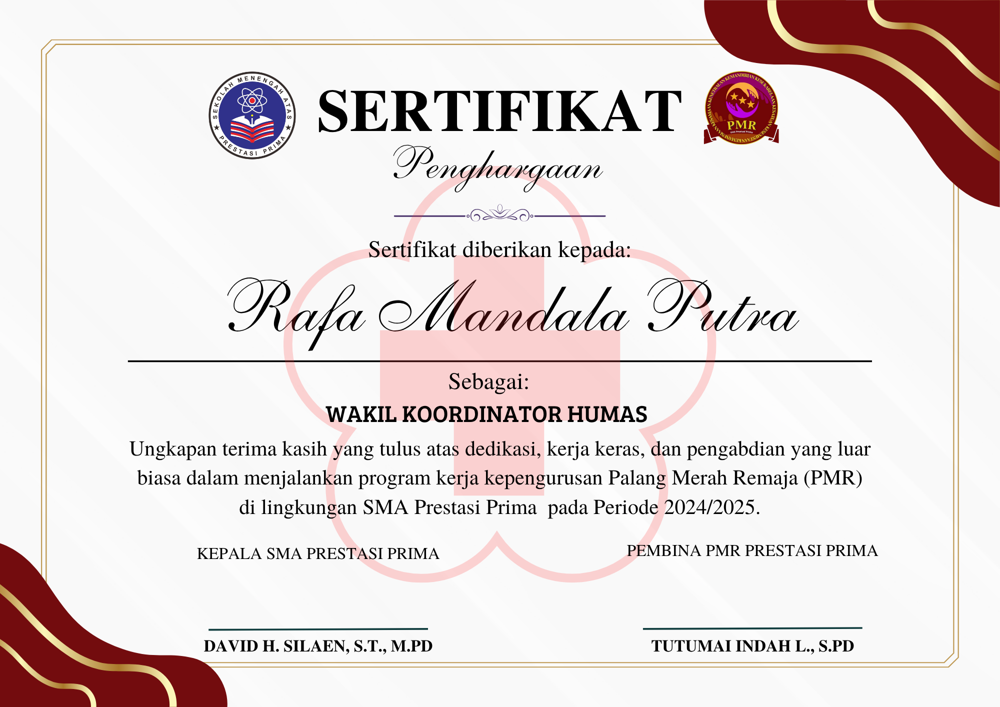
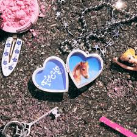

<h1 align="center">안녕하세요! Hello, I'm Rafa Mandala (라파) 👋</h1>

<p align="center">
  
</p>

<!-- Hiasan Coding Badges Dinamis -->
<p align="center">
  
  
  
</p>

<p align="center">
  
</p>

---

<div align="center">
  
</div>
👤 About Me
I am a **Software Engineering (PPLG)** student at **SMK Prestasi Prima**, focusing on building innovative web and mobile solutions. I enjoy working in a team, have strong problem-solving skills, and am always enthusiastic about learning new technologies. 

Hello everyone! :) These are the results of projects I have worked on. Some are school assignments, and others were made for personal use. Thank you!

- 🎓 **Education:** Software Engineering at SMK Prestasi Prima (July 2024 - Present).
- 🏛️ **Organization:** Vice Coordinator of Public Relations for PMR (2026).
- 🎮 **Hobbies:** Coding and building simple games in Roblox Studio.
- 📍 **Location:** East Jakarta, Indonesia.

<br clear="both">


<br>
🍰 <b>Born & Age:</b>  

### 🏫 School
<table align="center" width="100%">
  <tr>
    <th align="center" bgcolor="#222" style="color: #F7DF1E;">🏫 Institution</th>
    <th align="center" bgcolor="#222" style="color: #F7DF1E;">📅 Period</th>
    <th align="center" bgcolor="#222" style="color: #F7DF1E;">✨ Major / Notes</th>
  </tr>
  <tr>
    <td align="left">🎒 <b>SDN 02 Bojong Kulur</b><br><small>Elementary School</small></td>
    <td align="center">2015 - 2021</td>
    <td align="left">Primary Education</td>
  </tr>
  <tr>
    <td align="left">📚 <b>SMP PGRI 30</b><br><small>Junior High School</small></td>
    <td align="center">2021 - 2024</td>
    <td align="left">Secondary Education</td>
  </tr>
  <tr>
    <td align="left">💻 <b>SMK Prestasi Prima</b><br><small>Vocational High School</small></td>
    <td align="center">2024 - Present</td>
    <td align="left"><span style="color: #FA243C;"><b>Software Engineering (PPLG)</b></span><br>Web & Mobile Development Focus</td>
  </tr>
</table>


### 📜 Certificates

- **First Step Korean (첫걸음 한국어)** — Issued by **Yonsei University** via  ➔ [Verify Certificate](https://www.coursera.org/account/accomplishments/verify/JOQ4SKQRXO2W)
  <br><br>
  

<br>

- **Vice Coordinator of Public Relations for PMR (PMR 홍보부부장)** — Issued by **SMK Prestasi Prima**
  <br><br>
  
---

### 🛠️ Tech Stack & Tools
<table align="center">
  <tr>
    <td align="center" width="96">
      
      <br>Web Basics
    </td>
    <td align="center" width="96">
      
      <br>Languages
    </td>
    <td align="center" width="96">
      
      <br>Database
    </td>
    <td align="center" width="96">
      
      <br>Tools
    </td>
  </tr>
</table>

---

### 🚀 My Projects
| Project Name | Description | Tech Stack |
| :--- | :--- | :--- |
| 🤖 **[ChatBoxAzunya](https://github.com/RapaaMandiri/ChatBoxAzunya)** | Her name is Azunya Ai, using Python code and connected to the API from Google AI Studio. | Python |
| 📸 **[Galleri_Foto](https://github.com/RapaaMandiri/Galleri_Foto)** | A photo gallery to upload photos of views in the capital city of Jakarta (Group Project). | PHP, HTML, CSS |
| 👨‍💻 **[Portofolio_Rapa](https://github.com/RapaaMandiri/Portofolio_Rapa.github.io)** | This is my portfolio, it contains my profile and the projects I have made. | HTML |
| 📷 **[WebcamAzuria](https://github.com/RapaaMandiri/WebcamAzuria.github.io)** | The Azunyaa Webcam allows taking photos via the website, functioning like a photobox. | HTML |
| 🌃 **[PETUGAS-GERBANG-98](https://github.com/RapaaMandiri/PETUGAS-GERBANG-98-SHIFT-MENCEKAM)** | A game telling the story of toll officers during the 1998 Indonesian riots. | HTML |
| 🎫 **[Aespa-Ticket-Concert](https://github.com/RapaaMandiri/Aespa-Ticket-Concert)** | A website to buy aespa concert tickets and experience the ticket war quickly. | PHP |
|👨‍💻 **[Portofolio-Laravel](https://github.com/RapaaMandiri/Portofolio_Rapa.github.io)** | This is my portfolio (Laravel Version), it contains my profile and the projects I have made. | Laravel |
|💬 **[msn_messenger](https://github.com/RapaaMandiri/msn_messenger)** | A 2000s nostalgic MSN Messenger clone with live chat, group chat, invite codes, stickers, and nudges. | PHP, MySQL, JS |

---

### 📊 My GitHub Stats
<p align="center">
 
  
</p>

---

### 🐍 GitHub Contribution Snake (뱀 애니메이션)
<p align="center">
    
  </picture>
</p>

---

### 📱 Connect with Me
<p align="center">
<a href="mailto:mandalarafa2@gmail.com" target="_blank"></a> 
<a href="https://github.com/RapaaMandiri" target="_blank"></a>
<a href="https://instagram.com/azuriamandrian" target="_blank"></a>
<a href="https://tiktok.com/@@azuria_mandrian" target="_blank"></a>
<a href="https://youtube.com/@Azuriamandrian08" target="_blank"></a>
<a href="https://facebook.com/username_kamu" target="_blank"></a>
</p>

<p align="center">
  
</p>

<div align="center">
  <hr style="border: 1px dashed #333;" width="50%" />
  <br>
  
  <p align="center" style="font-family: 'Fira Code', monospace; color: #888;">
     
    &nbsp; <i>지금 재생 중...</i>
  </p>

  <table border="0" cellpadding="10" cellspacing="0">
    <tr>
      <td align="center" valign="middle">
        
      </td>
      <td align="left" valign="middle" style="font-family: 'Fira Code', monospace;">
        <h3 style="color: #F7DF1E; margin: 0 0 5px 0;">하츠투하츠 (hearts2hearts)</h3>
        <p style="font-size: 14px; margin: 0; line-height: 1.8;">
          💿 <a href="https://music.apple.com/id/song/focus/1841828520" target="_blank" style="color: #FA243C; text-decoration: none;"><b>포커스 (Focus)</b></a><br>
          🍎 <a href="https://music.apple.com/id/song/apple-pie/1841828522" target="_blank" style="color: #FA243C; text-decoration: none;"><b>애플 파이 (Apple Pie)</b></a>
        </p>
      </td>
    </tr>
  </table>

 <p align="center">
    <a href="https://music.apple.com/id/song/focus/1841828520" target="_blank">
      
    </a>
  </p>
  
  
<a href="https://music.apple.com/profile/azuria_m" target="_blank">
  
</a>
  
  <br><br>
  <hr style="border: 1px dashed #333;" width="50%" />
</div>

<h3 align="center">방문해 주셔서 감사합니다! (Thank you for visiting!) ✨</h3>

```python
developer = {
    "name": "Rafa Mandala",
    "role": "Software Engineering Student",
    "origin": "Indonesia 🇮🇩",
    "status": "Always Learning & Coding"
}

if developer["status"] == "Always Learning & Coding":
    print("Welcome to my digital workspace! Let's build something awesome.")
